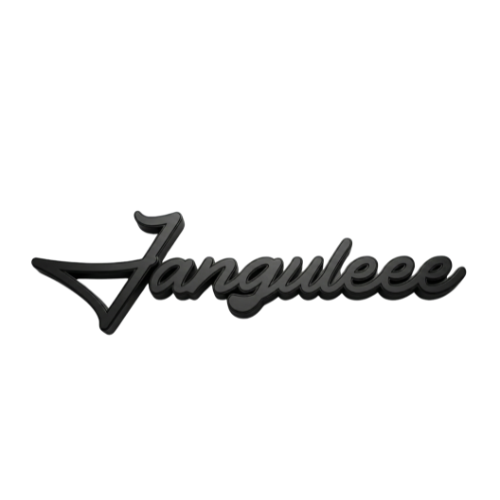

<div align="center">
  

# 🚍 JANGULEEE TRANS | OFFICIAL PLATFORM

**Website Resmi Layanan Sewa Bus Pariwisata Premium - Sumedang & Jawa Barat**

[](https://nextjs.org/)
[](https://tailwindcss.com/)
[](https://www.framer.com/motion/)
[](https://www.typescriptlang.org/)

  <p align="center">
    <a href="https://janguleee-trans.vercel.app/">🚀 Kunjungi Website</a>
    ·
    <a href="#-fitur-utama">✨ Fitur Utama</a>
    ·
    <a href="#-teknologi">🛠️ Teknologi</a>
  </p>
</div>

<br />

## 📖 Tentang Website Ini

Ini adalah platform digital resmi untuk **Janguleee Trans**, penyedia layanan sewa bus pariwisata terdepan di Sumedang. Website ini dibangun untuk memudahkan calon penyewa dalam mencari informasi armada, mengecek fasilitas, dan memesan perjalanan wisata dengan pengalaman pengguna yang premium, cepat, dan informatif.

Menggabungkan estetika modern dengan fungsionalitas tinggi, website ini memastikan setiap informasi tersampaikan dengan jelas—mulai dari spesifikasi armada Jetbus 5 terbaru hingga transparansi tanya-jawab layanan.

### 📸 Galeri Tampilan

<div align="center">
  
</div>
<br/>
<div align="center" style="display: flex; gap: 10px; justify-content: center;">
  
  
  
</div>

<br />

## ✨ Fitur Utama Platform

Website ini dilengkapi dengan berbagai fitur yang dirancang khusus untuk kenyamanan pengguna:

### � Eksplorasi Armada Premium

Menampilkan katalog lengkap armada (Jetbus 5, Medium Bus, HiAce Premium) dengan spesifikasi mendetail. Pengguna dapat melihat fasilitas interior dan eksterior melalui galeri interaktif yang menawan.

### � Informasi Perusahaan Transparan

- **Jejak Langkah (Timeline)**: Visualisasi sejarah dan pengalaman perusahaan dalam melayani pariwisata sejak 2015.
- **Statistik Terkini**: Menampilkan data nyata jumlah armada, pengalaman tahunan, dan kepuasan pelanggan secara real-time.

### 💡 Pusat Bantuan & Edukasi

- **FAQ Interaktif**: Bagian tanya-jawab lengkap untuk menjawab keraguan umum calon penyewa (harga, fasilitas, aturan booking).
- **Akses Kontak Cepat**: Integrasi tombol WhatsApp "Floating" yang memudahkan pengguna terhubung langsung dengan admin 24/7.

### � Performa & Teknologi Kelas Dunia

Website ini dioptimalkan untuk kecepatan dan kenyamanan pengguna:

- **Navigasi Cepat**: Perpindahan halaman instan tanpa loading lama berkat teknologi Next.js App Router.
- **Tampilan Responsif**: Sempurna diakses dari Smartphone, Tablet, maupun Laptop.
- **Scroll Halus (Lenis)**: Memberikan sensasi menjelajah yang mewah dan nyaman di mata.

---

## 🛠️ Stack Teknologi

Platform ini dibangun menggunakan fondasi teknologi web modern untuk menjamin stabilitas dan kemudahan pengembangan ke depan:

| Teknologi         | Peran                                                               |
| :---------------- | :------------------------------------------------------------------ |
| **Next.js 15**    | Kerangka kerja utama untuk performa server-side rendering maksimal. |
| **React 19**      | Membangun antarmuka interaktif yang responsif.                      |
| **Tailwind CSS**  | Menjamin konsistensi desain dan tampilan yang presisi.              |
| **Framer Motion** | Menghadirkan animasi halus untuk pengalaman yang hidup.             |
| **Lucide Icons**  | Visualisasi ikon yang bersih dan komunikatif.                       |

---

## 🚀 Instalasi & Pengembangan

Jika Anda ingin menjalankan proyek ini di lingkungan lokal Anda:

1. **Clone repository**

   ```bash
   git clone https://github.com/rangga11268/janguleee-trans.git
   ```

2. **Install dependensi**

   ```bash
   cd janguleee-trans
   npm install
   ```

3. **Jalankan server lokal**

   ```bash
   npm run dev
   ```

4. **Akses Website**
   Buka `http://localhost:3000` di browser Anda.

---

<div align="center">
  <p>Dikembangkan oleh <b>Antigravity</b> untuk <b>Janguleee Trans</b></p>
  <p>© 2024 Jang Uleee Bungsuna Transport. Hak Cipta Dilindungi.</p>
</div>
